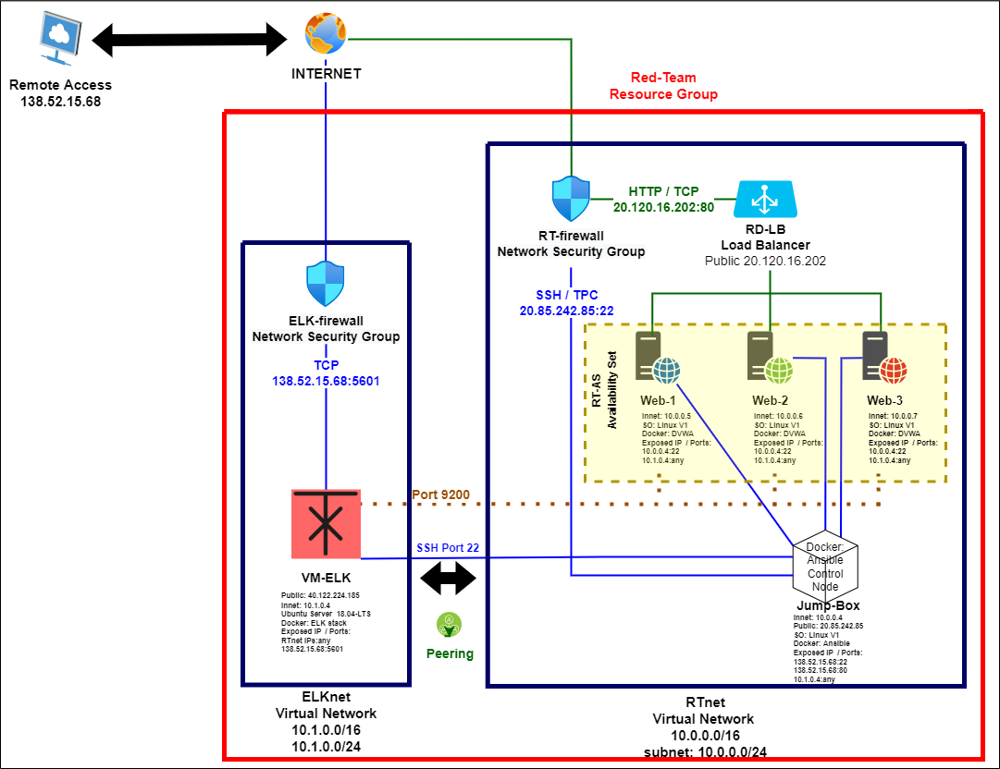

## Automated ELK Stack Deployment

The files in this repository were used to configure the network depicted below.

These files have been tested and used to generate a live ELK deployment on Azure. They can be used to either recreate the entire deployment pictured above. Alternatively, select portions of the *filebeat-playbook.yml* file may be used to install only certain pieces of it, such as Filebeat.

  
This document contains the following details:
- Description of the Topology
- Access Policies
- ELK Configuration
  - Beats in Use
  - Machines Being Monitored
- How to Use the Ansible Build

### Description of the Topology

The main purpose of this network is to expose a load-balanced and monitored instance of DVWA, the D*mn Vulnerable Web Application.

Load balancing ensures that the application will be highly *available*, in addition to restricting *overprocessing* to the network.

Integrating an ELK server allows users to easily monitor the vulnerable VMs for changes to the *logs* and system *metrics data*.

The configuration details of each machine may be found below.

| Name     | Function              | IP Address | Operating System |
|----------|-----------------------|------------|------------------|
| Jump Box | Gateway               | 10.0.0.4   | Linux            |
| VM-ELK   | Centralized-Log-Sever | 10.1.0.4   | linux            |
| Web-1    | Webserver             | 10.0.0.5   | Linux            |
| Web-2    | Webserver             | 10.0.0.6   | Linux            |
| Web-3    | Webserver             | 10.0.0.7   | Linux            |

### Access Policies

The machines on the internal network are not exposed to the public Internet. 

Only the *Jump Box* machine can accept connections from the Internet. Access to this machine is only allowed from the following IP addresses: *138.52.15.68*

Machines within the network can only be accessed by *Jump Box (10.0.0.4)*

A summary of the access policies in place can be found in the table below.

| Name     | Publicly Accessible | Allowed IP Addresses |
|----------|---------------------|----------------------|
| Jump Box |         yes         | 138.52.15.68         |
| VM-ELK   |         yes         | 138.52.15.68         |
| Web-1    |          no         |                      |
| Web-2    |          no         |                      |
| Web-3    |          no         |                      |

### Elk Configuration

Ansible was used to automate the configuration of the ELK machine. No configuration was performed manually, which is advantageous because *automatization saves resources like time and human errors. Future changes in configuration can be implemented faster and by only one person.*

The playbook implements the following tasks:
- Install docker.io.
- install python3.pip.
- Install docker module.
- Increase the use of virtual memory to 262144.
- Maintain the virtual memory increment after boot.
- Download and configure the ELK docker container.
- Run docker service automatically with every boot.

The following screenshot displays the result of running `docker ps` after successfully configuring the ELK instance.

### Target Machines & Beats
This ELK server is configured to monitor the following machines:
- Web-1: 10.0.0.5
- Web-2: 10.0.0.6
- Web-3: 10.0.0.7

We have installed the following Beats on these machines:
- Filebeat
- Metricbeat

These Beats allow us to collect the following information from each machine:
- Filebeat generates and organizes log files to send to Logstash and Elasticsearch. These logs include specific data such as changes in the file system and the time it occurs.
- Metricbeat collects the metric data from its host machine and ships those metrics to Elasticsearch or Logtash. It is possible to visualize this data through Kibana. These metrics are the measurements of behavior and usage of system resources like the CPU usage or Ram.

### Using the Playbook
In order to use the playbook, you will need to have an Ansible control node already configured. Assuming you have such a control node provisioned: 

SSH into the control node and follow the steps below:
- Copy the *elk-playbook.yml* file to */etc/ansible/roles*
- Update the *hosts* file to include *in line 30 down [elk] the ip of the virtual machine use to install ELK. add next to it "ansible_python_interpreter=/usr/bin/python3"* *Down [webserver] will be the ips of the machines inwhere the beats will be installed*
- Run the playbook, and navigate to *10.1.0.4* to check that the installation worked as expected.

## Commands
- *Download elk-playbook:* 
*curl -O https://upenn.bootcampcontent.com/upenn-bootcamp/upenn-virt-cyber-pt-08-2021-u-lol/-/blob/master/1-Lesson-Plans/13-Elk-Stack-Project/Activities/Stu_Day_1/Unsolved/Resources/install-elk.yml* 

- *To modify the playbook* 
    
     *nano elk-playbook* *To modify playbook* 

- *To install elk in the previous designated Virtual Machine on the hosts file*
    
     *ansible-playbook elk-playbook*

- *To check elk installation is working as expected"
    
     *ssh azadmin@10.1.0.4*
    *docker ps*
