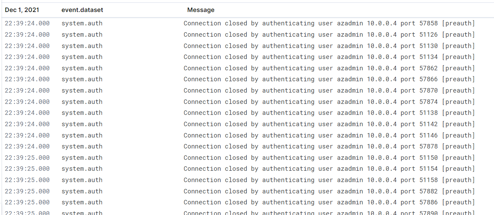

**SSH Barrage**

*Task: Generate a high amount of failed SSH login attempts and verify that Kibana is picking up this activity*

Inside the jump-Box VM run (out of the ansible docker container):
    
    while true; do ssh azadmin@10.0.0.5 ; ssh azadmin@10.0.0.6 ssh ; azadmin@10.0.0.7; done

Press Ctrl C to stop test 

Kibana Logs

**Linux Stress**

*Task: Generate a high amount of CPU usage on the pentesting machines and verify that Kibana picks up this data.*
- Install stress in the three Web Virtual Machines
- Run in each machine a different times using command: stress --cpu 1
- Stop stress test presing Ctrl C

Kibana screens of the stress activity

**DoS attack**

*Task: Generate a high amount of web requests to pen-testing servers and make sure that Kibana is picking them up.*

In the Junmp-Box VM run:

    while true; do for i in {5..7}; do wget -O /dev/null 10.0.0.$i; done; done
    
Press Ctrl C to stop test

Kibana Memory Usage

